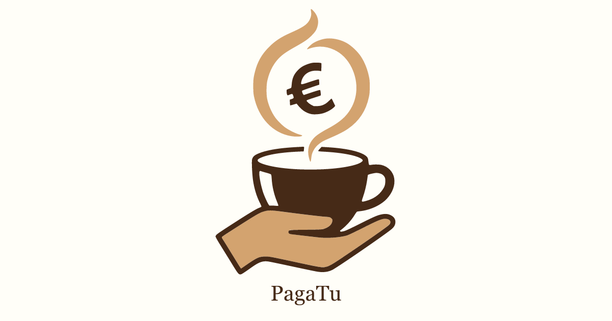
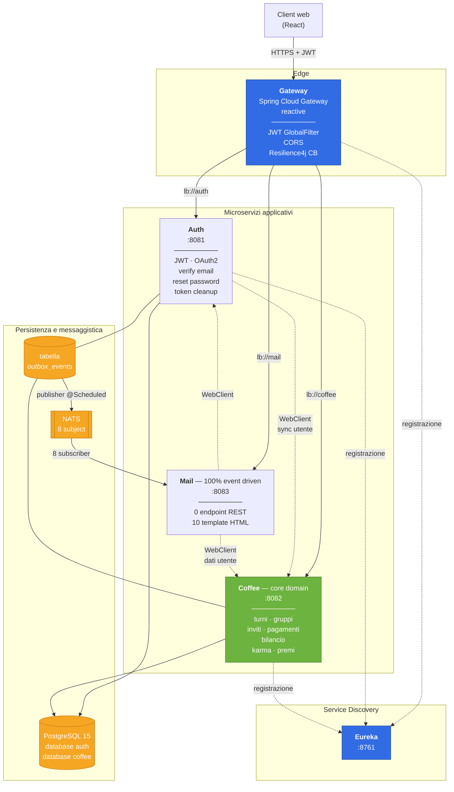
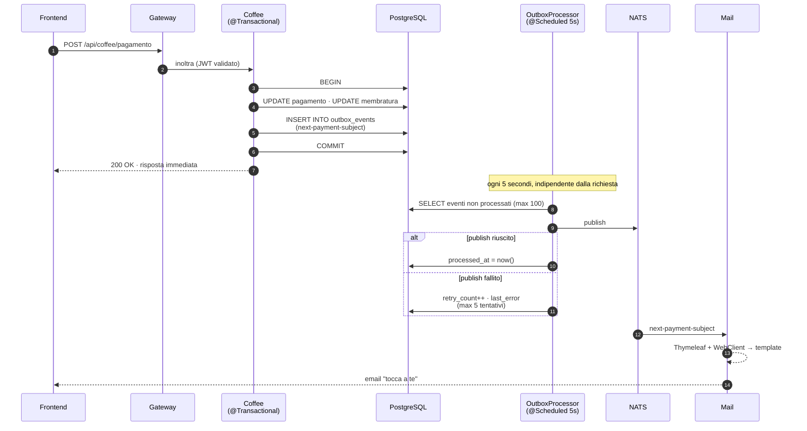

<p align="center">
  
</p>

<h1 align="center">PagaTu — Backend</h1>

<p align="center">
  <strong>Il caffè che unisce il team.</strong><br />
  Microservizi Spring Boot che trasformano il rituale di team «chi compra il caffè?»<br />
  in un sistema trasparente, gamificato e completamente automatizzato.
</p>

<p align="center">
  <a href="README.md"></a>
  
  
  
</p>

<p align="center">
  
  
  
  
  
  
  
  
</p>

<p align="center">
  <a href="https://github.com/Lele97/PagaTu-Backend/actions/workflows/PagaTu_Release_Automation.yml"></a>
  <a href="https://github.com/Lele97/PagaTu-Backend/releases"></a>
  
  
  
  
  
  
</p>

---

## Indice

- [Cos'è PagaTu](#cosè-pagatu)
- [Architettura](#architettura)
- [I cinque microservizi](#i-cinque-microservizi)
- [Il dominio: come funziona](#il-dominio-come-funziona)
- [Transactional Outbox](#transactional-outbox)
- [Sicurezza](#sicurezza)
- [Resilienza](#resilienza)
- [Stack tecnologico](#stack-tecnologico)
- [Getting Started](#getting-started)
- [Test](#test)
- [CI/CD](#cicd)
- [Struttura del repository](#struttura-del-repository)
- [Script e comandi utili](#script-e-comandi-utili)
- [Deployment](#deployment)
- [API e Swagger](#api-e-swagger)
- [Limiti noti e roadmap](#limiti-noti-e-roadmap)
- [Come contribuire](#come-contribuire)
- [Licenza](#licenza)

---

## Cos'è PagaTu

Il classico *«chi va a comprare il caffè?»* costa ai team tempo, malumore e zero tracciabilità di chi ha
pagato cosa. **PagaTu** lo risolve.

Ogni membro di un gruppo ha un **turno** assegnato e visibile. Può **registrare il pagamento**, **saltarlo**
(entro un limite) o **pagare per un collega**. Il gruppo mantiene **classifica**, **bilancio** con quota equa
e link di pagamento, e un sistema a **premi** gamificato.

Questo repository contiene il **backend**: un'architettura a **5 microservizi** Spring Boot, con il servizio
**Coffee** come core domain, e il servizio **Mail** completamente guidato da eventi.

> **Progetto personale end-to-end.** Architettura, implementazione, containerizzazione e deploy: tutto
> progettato e realizzato da zero.

<p align="center">
  
</p>

---

## Architettura



**Flusso di una richiesta**

1. Il client chiama il **Gateway** con `Authorization: Bearer &lt;JWT&gt;`.
2. Il filtro globale `JwtAuthenticationFilter` valida il token (HS256) e ne **blocca l'accesso** se manca o non
   è valido. Gli endpoint pubblici sono in allow-list.
3. Il Gateway instrada a `lb://auth`, `lb://coffee` o `lb://mail`, risolvendo l'host tramite **Eureka**.
4. Ogni servizio **rivalida il token** nei propri controller: il gateway non propaga l'identità, quindi ogni
   servizio è autonomo nel decidere.

---

## I cinque microservizi

| Servizio | Porta | Responsabilità | Dimensione |
|---|:---:|---|---|
| **`auth`** | 8081 | Identità: registrazione, login JWT, OAuth2 (Google, Microsoft), verifica email, reset password, pulizia batch dei token | 63 classi · 16 endpoint |
| **`coffee`** | 8082 | **Core domain**: turni, gruppi, inviti, pagamenti, salta/paga-per, bilancio, karma, premi | 102 classi · 36 endpoint |
| **`mail`** | 8083 | Consegna email. **Zero endpoint REST**: espone solo subscriber NATS | 19 classi · 8 subscriber |
| **`gateway-service`** | 8080 | Routing, validazione JWT, CORS, circuit breaker, fallback | 5 classi |
| **`eureka-server`** | 8761 | Service discovery | 1 classe |

**Totale: 190 classi Java, 12 controller, 52 endpoint REST.**

### `auth` — Identità

- Login e registrazione con **JWT** (JJWT, HS256, chiave Base64 da 256 bit, scadenza 24 h).
- **OAuth2** con Google (Identity Services, validazione via `tokeninfo`) e Microsoft (Graph API), con
  generazione automatica dello username in caso di collisione.
- **Verifica email** con token a 48 ore e **reset password** con token a 30 minuti.
- **Rate limiting** con Bucket4j sugli endpoint sensibili (3 tentativi/ora per IP) più un limite su base dati
  (10 richieste/24 h per email).
- **Batch di pulizia token** con `@Retryable` e fallback per token singoli, trigger manuale via
  `POST /api/admin/token-cleanup/trigger`.
- Sincronizzazione con il servizio Coffee via `WebClient` (registrazione e aggiornamento profilo).

### `coffee` — Core domain

Vedi [Il dominio](#il-dominio-come-funziona).

### `mail` — Consegna, disaccoppiata dal dominio

Il servizio **non ha un solo endpoint REST**. Si iscrive a **8 subject NATS** e per ciascuno produce una email
HTML con **Thymeleaf**:

| Subject | Template |
|---|---|
| `next-payment-subject` | `notifica-prossimo-pagatore.html` |
| `skip-payment-subject` | `notifica-saltato-pagamento-prossimo-pagatore.html` |
| `pay-for-topic` | `pagaper-pagatore.html` + `pagaper-ricevente.html` |
| `invitation-subject` | `invitation.html` |
| `invitation-response-subject` | `invitation-response-accepted.html` / `-rejected.html` |
| `turn-reminder-subject` | `promemoria-turno.html` |
| `reset-password-mail` | `reset-password.html` |
| `verify-email-mail` | `verify-email.html` |

Per arricchire i template il servizio chiama al volo gli altri servizi in modo **reattivo**
(`Mono.zip` su due `WebClient` in parallelo), invece di bloccare un thread. Locale `it_IT`, importi
formattati `%.2f€`, header MIME `List-Unsubscribe` e `X-Priority: 3`.

### `gateway-service` — Edge

- **Un solo filtro globale**: `JwtAuthenticationFilter` (`Ordered`, `getOrder() == 1`).
- **3 route** definite in Java DSL (`GatewayConfig.customRouteLocator`) verso `lb://auth`, `lb://coffee`,
  `lb://mail`. Non ci sono route statiche in YAML né `discovery.locator` attivo.
- **CORS** con `setAllowedOriginPatterns` (così funzionano i sottodomini wildcard di ngrok e Cloudflare),
  `allowCredentials(true)`, `maxAge` 3600.
- **Fallback** `503` su `/fallback/{auth,coffee,mail,default}`, raggiungibili da tutti i metodi HTTP.
- Al bootstrap verifica che `JWT_SECRET` sia Base64 valido e **fallisce l'avvio** se non lo è.

---

## Il dominio: come funziona

### Il turno

Ogni membro ha uno stato: `PAGATO`, `NON_PAGATO` o `SALTATO`. Il membro di turno è marcato con `myTurn = true`.

> **La rotazione è casuale, non FIFO.** Quando un pagamento viene registrato, il prossimo pagatore viene
> **estratto a caso** tra i membri in stato `NON_PAGATO`. Se non ne rimangono, il gruppo chiude il giro
> (`currentRoundNumber++`), tutti tornano `NON_PAGATO` e `roundSkipCount` viene azzerato.

Questo evita che si formino sempre gli stessi pattern e tiene vivo il gruppo. È una scelta di dominio
deliberata, non un oversight.

### Le regole del gruppo

Ogni gruppo ha regole configurabili dall'admin, applicate in `GroupRulesService`:

| Regola | Default | Vincolo |
|---|---|---|
| Skip per giro | `maxSkipPerRound` | configurabile per gruppo |
| Skip al mese | **4** | `MAX_SKIP_PER_MONTH` |
| Paga-per al mese | **4** | `MAX_PAYFOR_PER_MONTH` |
| Paga-per abilitato | `true` | disattivabile |
| Paga-per solo admin | `false` | attivabile |
| Ultimo non pagato | — | **non può saltare**: qualcuno deve pagare |

Il limite mensile si azzera in modo **lazy**: la membratura conserva `monthlySkipPeriod` (`YearMonth`) e il
contatore viene considerato `0` se il periodo è diverso da quello corrente. Nessun cron necessario.

### Il bilancio

`GroupBalanceService` calcola la **quota equa** (totale speso / numero di membri) e per ciascun membro il
pagato, la quota e il delta. Aggiunge i **debiti pairwise**: ogni pagamento «paga per un amico» genera una
voce `creditore → debitore` con importo e link Satispay/Revolut, così chi ha pagato per gli altri sa
esattamente quanto gli devono.

### La gamificazione

**Coffee Karma** — un valore `0-100` (default 50) aggiornato in modo moltiplicativo e poi limitato:

| Operazione | Effetto |
|---|---|
| `payment` | `karma × (1 + importo/100)` |
| `payment_for` | `karma × (1.05 + importo/100)` |
| `jump_turn` | `karma × 0.9` |

**7 premi** gestiti da `AwardService`, tutti **idempotenti**. Il trucco è `occurrenceKey`: un premio ripetibile
(streak, re del caffè del mese) usa una chiave che cambia a ogni nuova occorrenza, e un vincolo
`UNIQUE (utente, codice, occurrence_key)` sul database impedisce che lo stesso premio venga assegnato due
volte.

| Codice | Livello | Condizione |
|---|---|---|
| `primo-pagamento` | bronzo | almeno un pagamento |
| `gruppo-creato` | bronzo | admin di un gruppo |
| `streak-3` | bronzo | 3 pagamenti consecutivi |
| `streak-7` | argento | 7 pagamenti consecutivi |
| `affidabile` | argento | 5 pagamenti e 0 salti |
| `generoso` | oro | 3 / 5 / 10 / 20 «paga per un amico» |
| `re-del-caffe` | oro | miglior pagatore del mese nel gruppo |

`GrantHistoricalKings` ricalcola i re del caffè di tutti i mesi passati, quindi i premi non si perdono se il
codice viene rilasciato dopo il fatto.

---

## Transactional Outbox

Questo è il pattern più interessante del progetto, e quello che merita una sezione dedicata.

**Il problema.** Per notificare il cambio turno, il servizio Coffee deve fare due cose: scrivere i dati di
dominio e avvisare il servizio Mail. Se scrive prima nel database e poi la notifica fallisce, l'utente non
riceve mai l'email. Se invia prima la notifica e poi il commit fallisce, l'utente riceve un'email su un
cambio che non è avvenuto. Sono due sistemi, non c'è modo di essere atomici tra loro. Questo è il classico
**dual-write problem**.

**La soluzione adottata.** L'evento viene scritto nella **stessa transazione** che modifica i dati di dominio,
in una tabella `outbox_events`. Nessun `send`. Nessuna chiamata di rete dentro la transazione.



**Garanzie ottenute**

| Proprietà | Come |
|---|---|
| **Nessuna perdita** | l'evento è nella stessa transazione del dato di dominio: o esistono entrambi, o nessuno |
| **Nessuna notifica fantasma** | se il commit fallisce, l'evento non viene mai scritto, quindi non viene mai inviato |
| **Consegna almeno una volta** | retry automatico (max 5) con `retry_count` e `last_error` |
| **Nessun blocco** | la richiesta HTTP risponde subito, la pubblicazione avviene in background |
| **Ripulizia automatica** | eventi processati più vecchi di 7 giorni eliminati, cron notturno |

Lo stesso pattern è implementato in `auth` e in `coffee`, con lo stesso schema di tabella. Se NATS non è
raggiungibile l'`OutboxProcessor` **non entra neppure nel loop** e riprenderà al poll successivo.

---

## Sicurezza

| Aspetto | Implementazione |
|---|---|
| **Autenticazione** | JWT firmato HS256 (JJWT), chiave da `JWT_SECRET` in Base64, 24 h di validità |
| **Validazione al gateway** | filtro globale con allow-list di 13 path pubblici (login, register, OAuth, reset, verify, Swagger, actuator) |
| **CORS** | `allowedOriginPatterns` da configurazione, `allowCredentials(true)`, preflight `OPTIONS` gestito dal filtro |
| **Password** | BCrypt (`PasswordEncoder`); il cambio password è negato agli account OAuth |
| **OAuth2** | Google (Identity Services) e Microsoft (Graph), con username generato e controllo di collisione |
| **Rate limiting** | Bucket4j su forgot-password e verifica email: 3 tentativi/ora per IP, con `429` e header `Retry-After` |
| **Validazione input** | Bean Validation sui DTO, più vincoli custom (`@Age` sull'età minima) |
| **Gestione errori** | `@ControllerAdvice` centralizzato: **20 handler** in `auth`, **11** in `coffee`, risposte JSON uniformi |
| **SQL injection** | esclusivamente JPQL parametrizzato e named query, nessuna concatenazione di stringhe |
| **N+1** | query con `JOIN FETCH` espliciti sulle relazioni caricate insieme |

### Endpoint pubblici (allow-list del gateway)

```
/api/auth/login              /api/auth/register
/api/auth/oauth/google       /api/auth/oauth/microsoft
/api/auth/verify-email       /api/auth/resend-verification
/api/auth/forgotPassword     /api/auth/reset-password
/api/auth/resetPassword      /actuator     /swagger-ui
/v3/api-docs                 /fallback
```

---

## Resilienza

Al gateway, **3 circuit breaker Resilience4j** (più un'istanza di default), tutti con la stessa soglia:

| Parametro | Valore |
|---|---|
| `slidingWindowSize` | 10 |
| `failureRateThreshold` | 50 % |
| `waitDurationInOpenState` | 10 000 ms |
| `permittedNumberOfCallsInHalfOpenState` | 3 |
| `timeout-duration` (TimeLimiter) | 10 s |

A circuito aperto il Gateway risponde con il **fallback** dedicato: `503` e corpo JSON
`{ error, message, status }`. Timeout HTTP client: 5 s di connessione, 30 s di risposta.

**Retry e task schedulati**: `@EnableRetry` su `auth` e `coffee`, con template dedicato (3 tentativi, backoff
esponenziale da 1 s, max 10 s) per il batch di pulizia token.

I **7 task schedulati**:

| Task | Frequenza |
|---|---|
| `auth` · `OutboxProcessor.processOutbox` | ogni 5 s |
| `auth` · `OutboxProcessor.cleanupOldEvents` | cron notturno |
| `auth` · `TokenCleanupBatchJob` (2 metodi) | ogni 15 min |
| `coffee` · `OutboxProcessor.processOutbox` | ogni 5 s |
| `coffee` · `OutboxProcessor.cleanupOldEvents` | cron notturno |
| `coffee` · `TurnReminderService.processTurnReminders` | ogni ora |

---

## Stack tecnologico

| Categoria | Tecnologie |
|---|---|
| **Linguaggio** | Java 17 |
| **Framework** | Spring Boot 3.4.5 · Spring Cloud 2024.0.1 |
| **Gateway** | Spring Cloud Gateway (reattivo) |
| **Discovery** | Spring Cloud Netflix Eureka |
| **Persistenza** | PostgreSQL 15 · Spring Data JPA · Hibernate |
| **Migrazioni** | Flyway — **15 script** (5 `auth` + 10 `coffee`) |
| **Messaggistica** | NATS (JNATS 2.17) — 8 subject |
| **Sicurezza** | JJWT 0.11.5 · Spring Security · Bucket4j 7.6 |
| **Resilienza** | Resilience4j (CircuitBreaker + TimeLimiter) · Spring Retry |
| **Reattivo** | WebClient (Spring WebFlux) |
| **Email** | Spring Mail · Thymeleaf — 10 template |
| **Documentazione** | springdoc-openapi 2.3.0 · Actuator |
| **Build** | Maven multi-module (con wrapper) · Lombok |
| **Test** | JUnit 5 · Mockito · MockMvc · Spring Boot Test |
| **Qualità** | Qodana (`qodana-jvm-community`) |

---

## Getting Started

### Prerequisiti

- **JDK 17**
- **Docker** + **Docker Compose** (per lo stack completo)
- **Maven 3.9+** (oppure usa `./mvnw`, già incluso)
- `openssl` (solo per generare il `JWT_SECRET`)

### 1. Clona e configura l'ambiente

```bash
git clone https://github.com/Lele97/PagaTu-Backend.git
cd PagaTu-Backend
cp .env.template .env
```

Il file `.env` **non** deve mai essere committato. Per generare un segreto JWT sicuro:

```bash
openssl rand -base64 32
```

Incolla il risultato in `JWT_SECRET`. Compila anche `DB_PASSWORD`, `POSTGRES_PASSWORD` e le credenziali SMTP.

> Lo script `script/setup-env.sh` fa tutto questo in modo interattivo: genera il segreto, ti chiede i valori
> e sostituisce i placeholder `CHANGE_ME_*` nel `.env`.

### 2. Avvia lo stack completo

```bash
bash script/start-docker.sh
```

Lo script esegue, in ordine: build dei jar → build delle immagini → `docker compose up` → riepilogo delle
porte. Con l'argomento `logs` si-tailed i log di tutti i container:

```bash
bash script/start-docker.sh logs
```

### 3. Oppure: build e avvio manuali

```bash
# build di tutti i moduli
./mvnw clean install -DskipTests

# stack di sviluppo
docker compose -f docker-compose.local.yaml up -d
```

### Servizi e porte

| Servizio | URL |
|---|---|
| Gateway | http://localhost:8080 |
| Auth | http://localhost:8081 |
| Coffee | http://localhost:8082 |
| Mail | http://localhost:8083 |
| Eureka | http://localhost:8761 |
| PostgreSQL | `localhost:5433` |
| NATS | `localhost:4222` (monitor `localhost:8222`) |
| Mailpit (UI email) | http://localhost:8025 |

> Il compose "da produzione" (`docker-compose.yml`) include **Mailpit**, che è un server SMTP di test con
> interfaccia web: comodo per vedere le email senza inviare nulla a Gmail.

---

## Test

**102 metodi di test** JUnit 5 in **22 classi**, con la densità concentrata sul core domain.

| Modulo | Classi | Metodi | Cosa copre |
|---|:---:|:---:|---|
| `coffee` | 15 | **74** | `PaymentService` (10), `GroupService` (13), `BaseUserService` (8), `GroupSettingsService` (7), `GroupRulesService` (6), `CoffeeUserService` (5), `PaymentController` (4, MockMvc), `JwtService` (4), `ProfileService` (4), `AwardService` (3), `UserStatisticsService` (3), `PreferencesService` (2), `TurnReminderService` (2), `ProfileKeys` (2) |
| `auth` | 3 | 21 | `AuthService` (15), `ProfileService` (5) |
| `mail` | 2 | 5 | `EmailService` (4) |
| `gateway-service` | 1 | 1 | context load |
| `eureka-server` | 1 | 1 | context load |

```bash
# tutto
./mvnw test

# solo un modulo
./mvnw -pl coffee test

# un singolo test
./mvnw -pl coffee test -Dtest=PaymentServiceTest
```

I test di servizio sono **unit test con Mockito**: logica di dominio isolata, senza database.
Nei test il profilo usa **H2 in modalità PostgreSQL** con `ddl-auto: create-drop` e **Flyway disabilitato**.

> **Da sapere:** la pipeline attuale esegue `compile` con `-DskipTests`. I test si lanno
> manualmente o in locale. Se vuoi contribuire, portare i test in CI è un'ottima prima PR (vedi
> [Come contribuire](#come-contribuire)).

---

## CI/CD

`.github/workflows/PagaTu_Release_Automation.yml` — si attiva su push su `main` e `develop`
(ignorando i file Markdown) e su `workflow_dispatch`.

| Job | Cosa fa |
|---|---|
| `compile` | build in **matrix** dei 5 moduli (`-DskipTests`) |
| `qodana` | analisi statica **Qodana** — è in `continue-on-error`, quindi informa ma non blocca |
| `create-release` | versioning semantico automatico, branch `release/pagatu-vX.Y.Z`, tag, GitHub Release |
| `create-readme` | genera il README della release e lo allega |
| `sync-to-gitlab` | mirror del repository verso GitLab |

Il versioning è calcolato dallo script `script/version.sh`, che analizza i commit dalla tag precedente e
riconosce `BREAKING CHANGE` → MAJOR, `feat` → MINOR, `fix` → PATCH.

Il rilascio delle immagini è gestito da `script/buildone.sh`: build **multi-architrice**
(`linux/amd64` + `linux/arm64`) con `docker buildx`, push sul registry, e `kubectl rollout restart` del
deployment Kubernetes corrispondente — aggiornamento a rolling, senza downtime.

---

## Struttura del repository

```
PagaTu-Backend/
├── auth/                    # Identità, JWT, OAuth2
│   └── src/main/java/com/pagatu/auth/
│       ├── batch/           #   Batch di pulizia token
│       ├── config/          #   SecurityConfig, RateLimiterConfig, NatsConfig, WebClientConfig
│       ├── controller/      #   AuthController, ProfileController, TokenCleanupController
│       ├── dto/             #   9 DTO
│       ├── entity/          #   User, token, outbox
│       ├── exception/       #   Gerarchia di eccezioni
│       ├── repository/      #   5 repository
│       ├── security/        #   JWT
│       └── service/         #   AuthService, OAuthService, Outbox*, RateLimiterService
│
├── coffee/                  # ★ Core domain
│   └── src/main/java/com/pagatu/coffee/
│       ├── config/          #   SecurityConfig, NatsConfig
│       ├── controller/      #   8 controller
│       ├── dto/             #   37 DTO
│       ├── entity/          #   CoffeeUser, Group, Membership, Payment, UserAward, Invitation
│       ├── exception/       #   Eccezioni di dominio
│       ├── repository/      #   7 repository
│       ├── service/         #   PaymentService, GroupService, GamificationService, AwardService...
│       └── jwt/ mapper/ util/
│   └── src/main/resources/db/migration/   # 10 migrazioni Flyway
│
├── mail/                    # Consegna email, 100% event driven
│   ├── nats/                #   8 subscriber
│   ├── service/             #   EmailService (reattivo)
│   ├── event/               #   8 POJO evento
│   └── src/main/resources/templates/      # 10 template HTML
│
├── gateway-service/         # Edge
│   ├── config/              #   GatewayConfig (route), CorsConfig
│   ├── filter/              #   JwtAuthenticationFilter
│   └── controller/          #   FallbackController
│
├── eureka-server/           # Service discovery
│
├── script/                  # buildone.sh, start-docker.sh, setup-env.sh, version.sh, mavenone.sh
├── assets/                  # Logo e immagini per il README
├── docker-compose.yml           # stack completo, con Mailpit
├── docker-compose.local.yaml    # stack di sviluppo
├── init.sql                 # creazione database auth e coffee
├── Makefile                 # build-auth, build-coffee, build-eureka, build-gateway, build-mail, build-all
└── pom.xml                  # parent POM multi-modulo
```

### Le migrazioni Flyway

**`auth`** (5): schema iniziale `users` + token reset → outbox → OAuth e verifica email → allineamento schema.

**`coffee`** (10): schema iniziale `utenti`/`user_group`/`user_group_memberships`/`pagamento` → outbox →
turn tracking e inviti → regole skip e pay-for → profilo e preferenze → numero di giro e skip mensili →
premi (`user_awards` con vincolo unique su `occurrence_key`) → coffee karma.

Tutte sono scritte con `IF NOT EXISTS` / `IF EXISTS` e sono **ri-eseguibili** su uno schema generato da
Hibernate. In produzione girano con `validate-on-migrate: true` e `ddl-auto: validate`, quindi ogni
divergenza tra entità e schema viene fatta notare invece di essere silenziosamente corretta.

---

## Script e comandi utili

| Comando | Cosa fa |
|---|---|
| `bash script/start-docker.sh` | build + up + riepilogo porte |
| `bash script/start-docker.sh logs` | build + up + log di tutti i container |
| `bash script/setup-env.sh` | genera `.env` in modo interattivo, con `JWT_SECRET` a 256 bit |
| `bash script/buildone.sh coffee` | build e deploy di un singolo servizio (multi-arch + rollout) |
| `bash script/buildone.sh all` | tutti e cinque |
| `bash script/version.sh next` | mostra la prossima versione calcolata dai commit |
| `bash script/mavenone.sh` | `mvn clean install` dei 5 moduli |
| `make build-all` | shortcut per `buildone.sh all` |

`buildone.sh` richiede `script/.env.buildone` con `REGISTRY_URL`, `DOCKER_USERNAME` e `DOCKER_PASSWORD`:
quel file è gitignored e va creato a parte.

---

## Deployment

### Docker

I cinque `Dockerfile` usano `eclipse-temurin:17-jre` e un singolo stage (`COPY target/*.jar app.jar`).
Le immagini si costruiscono multi-architrice con `docker buildx` e si pushano su un registry privato.

```bash
docker buildx build --platform linux/amd64,linux/arm64 \
  -t <registry>/pagatu-coffee:latest --push ./coffee
```

### Kubernetes

I manifest vivono nel repository **`PagaTu-Cluster`** (privato) e sono organizzati con **Kustomize**:
una base comune più due overlay, `local` e `cloud`.

| Risorsa | Impiego |
|---|---|
| `Deployment` | `pagatu-fe`, `pagatu-gateway`, `pagatu-eureka`, `pagatu-auth`, `pagatu-coffee`, `pagatu-mail`, `nats`, `postgres` |
| `Service` | ClusterIP per i microservizi, esposti via Ingress |
| `Ingress` | NGINX con terminazione TLS |
| `ConfigMap` | `pagatu-app-config`, `pagatu-db-config`, `postgres-init` |
| `Secret` | `pagatu-jwt-secret`, `pagatu-mail-secret`, `pagatu-db-secret` |
| `PersistentVolumeClaim` | volume per PostgreSQL |

Infrastruttura: **K3s v1.32 su Hetzner Cloud**, Cloud Load Balancer, Hetzner Cloud Volumes, **cert-manager**
con Let's Encrypt, registry privato con backend S3, metrics server. La struttura è **Helm-ready**.

---

## API e Swagger

Ogni servizio espone la propria documentazione OpenAPI tramite springdoc. Le rotte pubbliche attraverso il
gateway sono `/swagger-ui` e `/v3/api-docs`.

> Il gateway **non** aggrega la documentazione dei singoli servizi: ogni servizio va consultato al proprio
> endpoint.

---

## Limiti noti e roadmap

Sono elencati apertamente, così chi contribuisce sa dove intervenire.

| Area | Stato attuale | Direzione |
|---|---|---|
| **Test in CI** | la pipeline compila con `-DskipTests` | eseguire la suite a ogni push, con coverage report |
| **Test di integrazione** | solo unit test con Mockito, H2 con Flyway disabilitato | Testcontainers con PostgreSQL reale per validare le migrazioni |
| **Rate limiting** | in-memory, solo su `auth` | backend distribuito con Redis, al gateway, con header `X-RateLimit-*` |
| **Refresh token** | un solo JWT da 24 h in `localStorage` | access + refresh token, rotazione, blacklist |
| **Notifiche push** | solo email | canale real-time (SSE o WebSocket) per il cambio turno |
| **Osservabilità** | Actuator + log | correlation ID propagato, tracing distribuito |
| **Documentazione API** | OpenAPI per servizio | aggregazione al gateway |
| **Caching** | Caffeine configurato ma senza `@Cacheable` | oppure rimuovere la configurazione inutilizzata |
| **Badge** | due sistemi sovrapposti con codici diversi | unificare in una sola sorgente |
| **Sicurezza** | JWT in `localStorage` lato client | `httpOnly` cookie + SameSite |
| **Dockerfile** | single stage, senza utente non-root | multi-stage con utente dedicato |

---

## Come contribuire

Le contribuzioni sono benvenute, in particolare sul **backend**. Ecco da dove partire.

### Prima di tutto

Cerca le issue aperte e i `good first issue`: sono il posto più semplice per il primo contributo. Se hai un'
idea, aprila prima in una issue così ne parliamo prima di scrivere codice.

### Setup

```bash
git clone https://github.com/Lele97/PagaTu-Backend.git
cd PagaTu-Backend
cp .env.template .env        # poi genera JWT_SECRET con: openssl rand -base64 32
./mvnw clean install
./mvnw test
```

Prima di aprire una PR: `./mvnw clean install` deve passare e `./mvnw test` deve essere verde.

### Come organizzare il codice

- **Un servizio, una responsabilità.** Se una modifica tocca `coffee`, quasi certamente non tocca `auth`.
- **Mai chiamare un servizio da un altro in modo sincrono** se l'evento può essere differito: pubblicalo
  sull'outbox. È il principio che regge l'architettura.
- **Le regole di dominio stanno in `GroupRulesService`, non nei controller.** I controller validano il
  formato della richiesta, non la business logic.
- **Nuovi tipi di errore** → nuova eccezione che estenda `BusinessException` e un handler in
  `GlobalExceptionHandler`. Le risposte di errore devono restare uniformi.
- **Nuove query** → named query JPQL con `JOIN FETCH` esplicito. Niente concatenazione di stringhe.
- **Cambiamenti di schema** → nuova migrazione Flyway `V<n>__descrizione.sql`, con `IF NOT EXISTS`, mai
  distruttiva. Non modificare una migrazione già applicata.

### Prime PR utili

1. **Far girare i test in CI.** Il job `compile` usa `-DskipTests`: toglierlo e aggiungere un job separato è
   un contributo piccolo e di grande valore.
2. **Test di integrazione con Testcontainers** per validare che le 15 migrazioni producano davvero lo schema
   atteso dalle entità.
3. **Coverage report** (JaCoCo) pubblicato come artifact.
4. **Dockerfile multi-stage con utente non-root** per i cinque servizi.
5. **Correlation ID** propagato dal gateway, con il filtro globale corrispondente.
6. **Endpoint di health** con readiness/liveness più granulari.

### Commit e versionamento

Il versioning è **semantico** e calcolato automaticamente dal messaggio di commit:

| Prefisso | Effetto |
|---|---|
| `BREAKING CHANGE:` o `breaking:` | MAJOR |
| `feat:` o `feature:` | MINOR |
| `fix:` o `bug:` | PATCH |

Conventional Commits, quindi: `feat(coffee): aggiungi il limite di skip settimanale`.

---

## Licenza

MIT — vedi [LICENSE](LICENSE).

```
Copyright (c) 2025-2026 Gabriele Grandinetti
```

---

## Progetti collegati

| Repository | Contenuto |
|---|---|
| **[PagaTu-Frontend](https://github.com/Lele97/PagaTu-Frontend)** | React 18 · Vite · React Router 7 · PWA |
| `PagaTu-Cluster` *(privato)* | K3s su Hetzner · Kustomize · cert-manager |

---

<p align="center">
  <sub>
    Fatto con ☕ da <a href="https://github.com/Lele97">Lele97</a>
  </sub>
</p>
